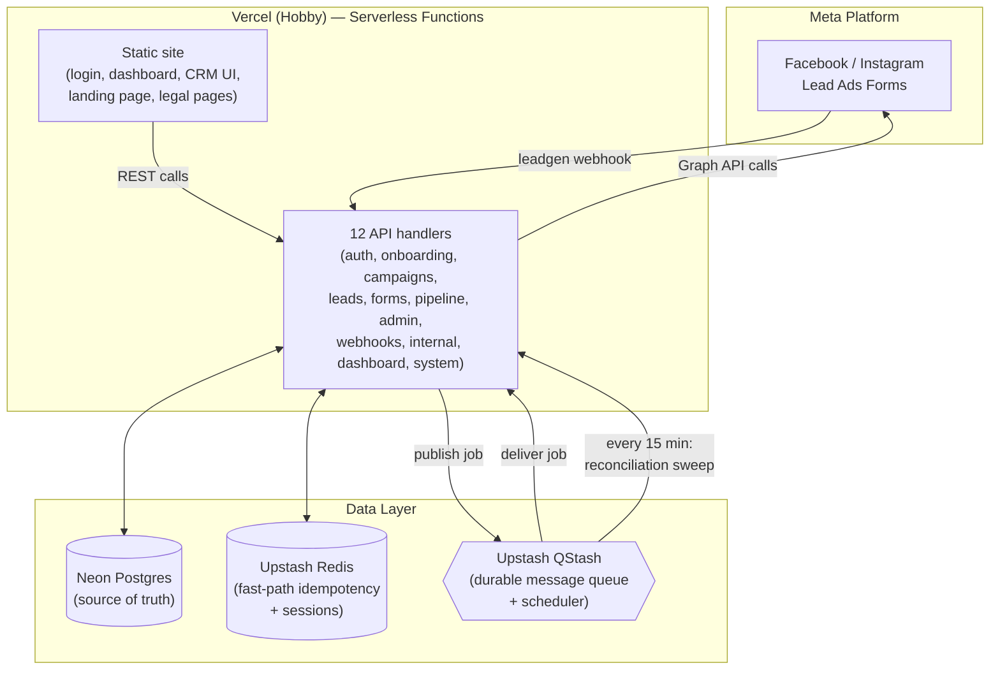
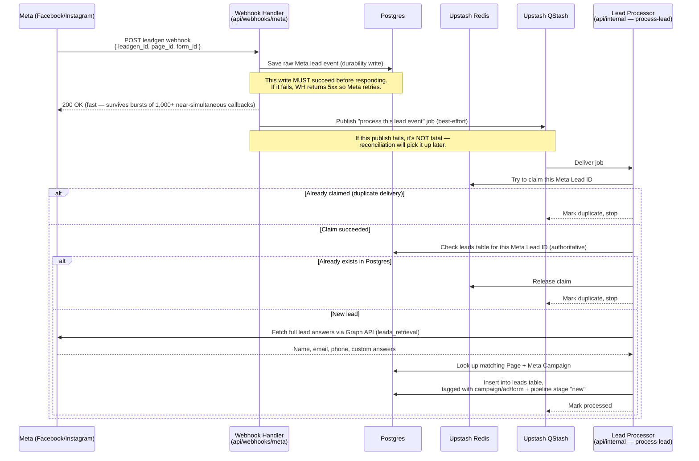
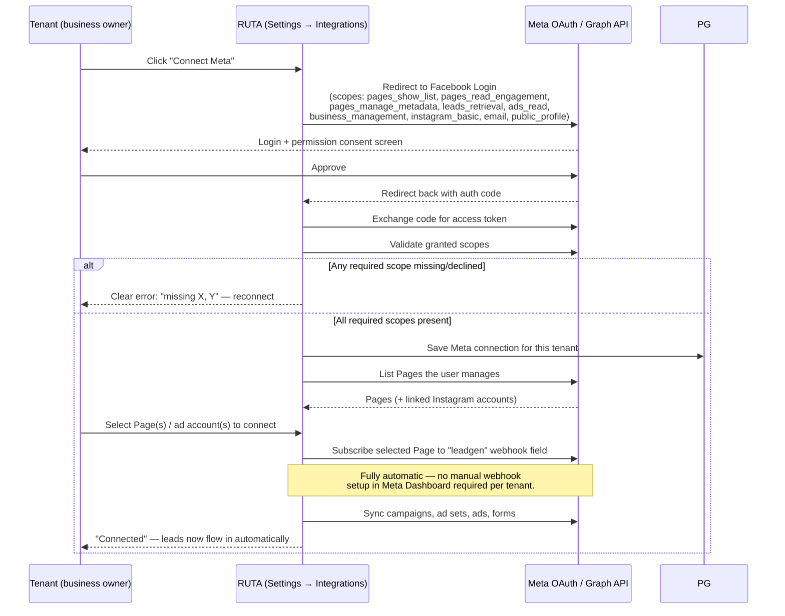
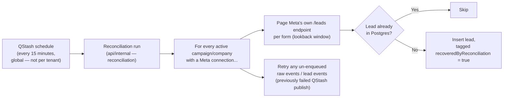
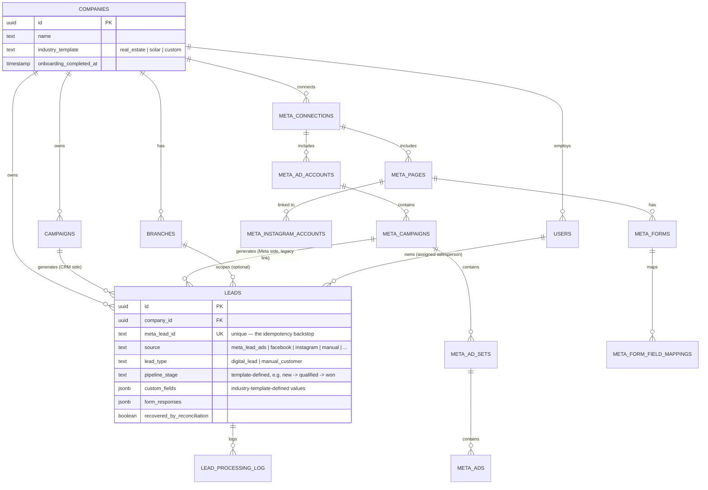

# RUTA — Lead Management System

**Meta (Facebook/Instagram) Lead Ads → CRM, fully automated.**

RUTA is a multi-tenant CRM. Each business ("tenant") signs up, connects their own Meta account in a few clicks, and every lead that comes in through their Facebook/Instagram Lead Ads forms lands in their CRM pipeline automatically — no Zapier, no manual CSV exports, no missed follow-ups. It's built to run entirely on free-tier infrastructure (Vercel Hobby, Neon, Upstash) while still being safe for real production lead volume.

This document explains what the system does, how data flows through it end to end, the full technology stack, and how to run it locally and deploy it. It's written so a non-technical reader can follow the diagrams, and a developer can find every technical detail underneath.

---

## Table of contents

1. [What RUTA does](#what-ruta-does)
2. [System architecture at a glance](#system-architecture-at-a-glance)
3. [Technology stack](#technology-stack)
4. [How a lead gets from Facebook into the CRM](#how-a-lead-gets-from-facebook-into-the-crm)
5. [Connecting a Meta account (OAuth flow)](#connecting-a-meta-account-oauth-flow)
6. [The reconciliation safety net](#the-reconciliation-safety-net)
7. [Multi-tenancy & data model](#multi-tenancy--data-model)
8. [The 12-function API design](#the-12-function-api-design)
9. [Prerequisites](#prerequisites)
10. [Local development](#local-development)
11. [Deploying to production (all free tier)](#deploying-to-production-all-free-tier)
12. [Key endpoints](#key-endpoints)
13. [n8n](#n8n)
14. [Security hardening](#security-hardening)
15. [Tests](#tests)

---

## What RUTA does

A business running Facebook/Instagram Lead Ads normally has to log into Meta Ads Manager, export leads, and manually copy them into a spreadsheet or CRM — every day, per campaign. Leads go stale within minutes of being submitted, and the busier the ad campaign, the more slip through.

RUTA removes that entirely:

- A tenant connects their Meta Business account once, through a standard Facebook Login popup.
- RUTA lists their Facebook Pages, ad accounts, and Instagram accounts, and lets them pick which ones to connect.
- From that point on, every new Lead Ads submission is pushed to RUTA by Meta in real time, automatically tagged with the exact campaign/ad/form that produced it, and dropped straight into the tenant's sales pipeline.
- Salespeople work leads through configurable pipeline stages (industry-specific for Real Estate and Solar today, generic custom fields for anything else), assign owners, set follow-ups, and convert leads to customers — all inside RUTA, without ever opening Meta Ads Manager.
- If Meta's webhook ever misses a delivery, a background safety net catches it within 15 minutes, so no lead is ever silently lost.

---

## System architecture at a glance



RUTA has no traditional always-on server. Every piece of logic runs as a short-lived Vercel serverless function, triggered either by an HTTP request (a user action, or a Meta webhook) or by a QStash-scheduled message. Postgres is the single source of truth for everything; Redis and QStash exist purely to make that Postgres-backed system fast and resilient, never as an alternate source of truth.

---

## Technology stack

| Layer | Technology | Why |
|---|---|---|
| Hosting / compute | **Vercel** (Hobby plan) | Serverless functions, static hosting, and cron — free tier is enough to run this at real production lead volume, provided the function count stays within Hobby's 12-function cap (see [below](#the-12-function-api-design)). |
| Database | **Neon** (serverless Postgres) | Source of truth for every tenant, user, lead, campaign, and Meta connection. Free tier, works natively with `pg`/Drizzle, has a pooled connection string for app traffic and a direct one for migrations. |
| ORM / migrations | **Drizzle ORM** + `drizzle-kit` | Type-safe schema and queries against Postgres; migrations are plain generated SQL, run automatically on every deploy. |
| Cache / fast-path store | **Upstash Redis** | Sub-millisecond idempotency claims during lead ingestion, and session/token lookups — never the system of record. |
| Message queue & scheduler | **Upstash QStash** | Durable at-least-once delivery for background jobs (lead processing) and the recurring reconciliation sweep — chosen because Vercel Hobby's own cron only fires once a day, far too infrequent for a 15-minute safety net. |
| Auth | Custom JWT session auth (`jose`) + `bcryptjs` | Email/password login for CRM users, stored as HTTP-only session cookies; independent of the Meta OAuth flow used for lead-source connections. |
| Secrets at rest | AES encryption (`src/infrastructure/security/encryption.ts`) | Legacy per-campaign Meta credentials and tenant-level Meta access tokens are stored encrypted in Postgres, never in plaintext. |
| External API | **Meta Graph API** (Facebook Login for Business, Lead Ads, Marketing API read-only) | Powers the "Connect Meta" flow, Page/ad-account/Instagram discovery, automatic webhook subscription, and lead retrieval. |
| Frontend | Static HTML/CSS/vanilla JS (`public/`) | No frontend framework/build step — every page is a plain static file served directly by Vercel, calling the JSON API. |
| Local dev only | Docker Compose (Postgres + a Redis-over-HTTP shim) | Lets the whole pipeline run offline with the same code paths as production, before pushing to a preview deploy. Production has no containers. |
| Testing | **Vitest** | Flow-level tests for OAuth, webhook ingestion, sync, and failure-recovery scenarios (see [Tests](#tests)). |
| Language | **TypeScript** (strict), Node.js ≥ 20 | Shared types across API handlers, application logic, and the database layer. |

---

## How a lead gets from Facebook into the CRM

RUTA actually runs **two** lead-ingestion pipelines side by side:

- **Tenant-level (automatic)** — the primary, current pipeline. Starts the moment a tenant connects their Meta account via OAuth; no per-campaign setup needed.
- **Legacy per-campaign** — an older pipeline kept alive for backward compatibility with campaigns configured before automatic tenant-level sync existed (each with its own manually-entered Meta app secret/verify token, stored encrypted). Both pipelines feed the same `leads` table and are both covered by reconciliation (see below).

Here's the tenant-level flow, which every new connection uses:



Two design choices matter here, and they run through the whole system:

1. **Durability write first, best-effort publish second.** The raw webhook payload is written to Postgres *before* RUTA ever tells Meta "OK" — so even if the QStash publish that follows fails outright, the event already exists safely in the database and reconciliation will find and process it. Nothing is thrown away on a transient failure.
2. **Two-layer idempotency.** Redis gives an instant "have I seen this Lead ID?" check so duplicate webhook deliveries (Meta retries, QStash at-least-once redelivery) don't do wasted work. But a Redis miss is never treated as proof a lead is new — Postgres's unique index on Meta Lead ID is the real authority, so a lead can never be inserted twice even if Redis's cache is cold or was flushed.

If a lead's Meta campaign hasn't been synced yet, or has been synced but not yet mapped to a CRM campaign, the lead is still captured immediately — just left unmapped until sync/mapping catches up — rather than dropped or retried forever.

---

## Connecting a Meta account (OAuth flow)



RUTA requests exactly the permissions it uses and nothing more — it never requests `ads_management`, `pages_manage_ads`, or the ability to manage Page content, messages, or posts. `ads_read`, `pages_read_engagement`, and `business_management` are all used **read-only**, purely to let a tenant pick their own Pages/ad accounts/campaigns and to attribute leads to the ad that produced them. Of the nine requested scopes, six (`pages_show_list`, `pages_read_engagement`, `pages_manage_metadata`, `leads_retrieval`, `ads_read`, `business_management`) are validated as required at connect/reconnect time — if a tenant declines one mid-flow, they get a specific "here's exactly what's missing" error rather than a confusing failure later.

Getting Facebook Login to work for tenants who are *not* Admins/Testers/Developers on the Meta App requires clearing four independent Meta gates: the app must be **Published**; the business behind the app must complete **Business Verification**; the app must separately complete **Access (Tech Provider) Verification**, required for any app that accesses other Businesses' assets; and each individual Advanced Access permission (everything above except `email`/`public_profile`) needs its own **App Review** approval before it works for the general public. See `docs/META_APP_REVIEW_PERMISSIONS.md` for the permission-by-permission justifications submitted for App Review.

---

## The reconciliation safety net

Webhooks are fast but not guaranteed — a dropped delivery, a Meta retry storm, or a failed QStash publish could in theory leave a lead un-ingested. Reconciliation exists so that never happens silently.



A few deliberate choices:

- **One global schedule, not one per tenant.** Upstash QStash's free tier caps the number of schedules; running one recurring job that loops over every tenant/campaign internally keeps RUTA well within that limit no matter how many tenants sign up. The interval is configurable via `RECONCILIATION_CRON` (default every 15 minutes) and the lookback window via `RECONCILIATION_LOOKBACK_HOURS` (default 6 hours).
- **QStash, not Vercel Cron, for the frequent sweep.** Vercel Hobby's built-in cron can only fire once per day — far too infrequent for a safety net meant to catch gaps within minutes. QStash's scheduler has no such restriction. Vercel's own daily cron is still wired up in `vercel.json` as a once-a-day fallback trigger for the same endpoint, authenticated with `CRON_SECRET`.
- **Covers both pipelines.** Reconciliation sweeps the tenant-level `meta_lead_events` table and the legacy per-campaign raw-event table in the same run, so both ingestion paths are protected by the same net.
- Every lead recovered this way is flagged `recoveredByReconciliation = true`, so it's always possible to see exactly how many leads the webhook path missed and reconciliation caught.

---

## Multi-tenancy & data model

Every tenant's data lives in the same Postgres database, isolated by a `company_id` foreign key on every tenant-scoped table — there is no per-tenant database or schema. Application-layer checks (never just UI-level) enforce that a user can only ever read or write rows belonging to their own company.



Key points this diagram doesn't show directly:

- `leads.meta_lead_id` has a **unique index** in Postgres — this is the single, authoritative guarantee that a lead can never be duplicated, no matter how many times a webhook or QStash job redelivers it.
- The CRM pipeline stages and custom lead fields are **industry-template-driven** (`src/domain/industryTemplates.ts`), not hard-coded — Real Estate and Solar currently ship dedicated templates; any other business uses a generic custom-fields/stages setup.
- `leadType` distinguishes leads that arrived automatically (`digital_lead`) from ones a salesperson entered by hand (`manual_customer`); `source` separately tracks the actual origin (`meta_lead_ads`, `facebook`, `instagram`, `website`, `referral`, `phone`, `walk_in`, `whatsapp`, `manual`, `other`).
- `webhook_configs` / `raw_meta_events` are the legacy per-campaign tables kept for backward compatibility alongside the newer `meta_connections` / `meta_lead_events` tenant-level tables described above.
- `branches` let a company optionally split leads/users by office or location; a lead's `branch_id` is nullable (company-wide/unassigned) and set automatically from the owning campaign or submitting form.

---

## The 12-function API design

Vercel's Hobby plan caps a project at **12 serverless functions**. RUTA has far more than 12 logical endpoints, so each Hobby "function" is actually a **consolidated handler** that routes many logical endpoints internally via a query-string parameter, with `vercel.json` rewriting clean URLs into that form. For example, `POST /api/auth/login` is rewritten to `POST /api/auth/handler?action=login` behind the scenes — callers never see the difference.

| Function file | Handles |
|---|---|
| `api/auth/handler.ts` | register, login, refresh, logout, me, change-password |
| `api/onboarding/handler.ts` | company setup, onboarding completion |
| `api/webhooks/meta/handler.ts` | Meta `leadgen`/page-event webhooks, and the entire "Connect Meta" OAuth flow (connect, callback, status, disconnect, select, sync, sync-status, webhook retry, Meta forms + field mapping) |
| `api/leads/handler.ts` | list/get/update leads, pipeline stage changes |
| `api/campaigns/handler.ts` | CRM campaigns, Meta campaign mapping/unmapping, per-campaign legacy webhook config |
| `api/forms/handler.ts` | internal + public lead-capture forms, submissions, publish/archive/set-default |
| `api/pipeline/index.ts` | pipeline stage configuration |
| `api/dashboard/index.ts` | dashboard summary data |
| `api/admin/roles/handler.ts` | role management |
| `api/admin/users/handler.ts` | user management, branches |
| `api/internal/handler.ts` | process-lead (QStash job target), reconciliation (QStash job target), dead-letter handling |
| `api/system.ts` | health check, monitoring metrics, permission catalog |

Each handler has its own `maxDuration` tuned to what it actually needs (the webhook and internal-job handlers get up to 60s for Graph API round-trips; most user-facing endpoints run at 10–15s).

---

## Prerequisites

- Node.js ≥ 20
- Docker (local Postgres + a Redis-over-HTTP shim only — production has no containers)
- Free accounts: [Vercel](https://vercel.com), [Neon](https://neon.tech), [Upstash](https://upstash.com)
- A Meta App (Facebook Login for Business + Lead Ads) with its App ID/Secret

---

## Local development

```bash
npm install
cp .env.example .env   # fill in AUTH_JWT_SECRET, ENCRYPTION_KEY, META_*, Upstash values

# 1. Start local Postgres + the Upstash-compatible Redis HTTP shim
docker compose up -d

# 2. Apply the database schema
npm run db:generate    # only needed after changing src/infrastructure/db/schema.ts
npm run db:migrate

# 3. Start a local QStash emulator (separate terminal)
npx @upstash/qstash-cli dev
# copy the printed QSTASH_TOKEN / signing keys into .env

# 4. Start the app (separate terminal)
npm run start:dev   # or: npx vercel dev, defaults to http://localhost:3000
```

Meta and QStash both need to reach your machine over HTTPS. Use a tunnel (`ngrok http 3000` or `cloudflared tunnel --url http://localhost:3000`) and set `PUBLIC_BASE_URL` to the tunnel URL before testing real webhook deliveries end-to-end.

Register the recurring reconciliation schedule once:

```bash
npm run setup:schedules
```

---

## Deploying to production (all free tier)

1. **Neon** — create a project, copy the pooled connection string into `DATABASE_URL` on Vercel (leave `DB_DRIVER` unset there so the app uses the Neon HTTP driver). Also copy the DIRECT (non-pooled) connection string into `MIGRATE_DATABASE_URL`. Migrations run automatically as part of `npm run build` (`scripts/migrate.ts`) on every deploy — set this for every Vercel environment you deploy to (Production, and Preview too if you want preview builds to succeed), or the build fails with "Neither MIGRATE_DATABASE_URL nor DATABASE_URL is set."
2. **Upstash Redis** — create a Redis database, copy the REST URL/token into `UPSTASH_REDIS_REST_URL` / `UPSTASH_REDIS_REST_TOKEN`.
3. **Upstash QStash** — copy `QSTASH_TOKEN`, `QSTASH_CURRENT_SIGNING_KEY`, `QSTASH_NEXT_SIGNING_KEY`.
4. **Vercel** — `vercel link`, set every variable from `.env.example` as an Environment Variable (Production + Preview) — including `META_APP_ID`, `META_APP_SECRET`, `META_WEBHOOK_VERIFY_TOKEN` (≤ 64 characters), `AUTH_JWT_SECRET`, `ENCRYPTION_KEY`, `CRON_SECRET` — then `vercel --prod`. Set `PUBLIC_BASE_URL` to the assigned `*.vercel.app` domain (or your custom domain) **before** the first deploy that runs `setup:schedules`, since QStash needs a real, reachable URL to schedule against.
5. Run `npm run setup:schedules` once (pointed at prod env vars) to register the QStash reconciliation schedule.
6. **Meta webhook subscription is automatic — no manual step here.** The first time any tenant completes "Connect Meta," RUTA itself calls the Graph API to subscribe the app (and that tenant's selected Page) to the `leadgen` field, using `PUBLIC_BASE_URL` and `META_WEBHOOK_VERIFY_TOKEN` from your env vars. You only need those two set correctly in Vercel before the first tenant connects — there is no longer a manual "subscribe the leadgen field in Meta Dashboard → Webhooks" step to perform.

Then, in the Meta App Dashboard, complete Business Verification, Access (Tech Provider) Verification, and App Review for each Advanced Access permission RUTA requests — see `docs/META_APP_REVIEW_PERMISSIONS.md` — so Facebook Login works for tenants who aren't listed as Admins/Testers on the app.

---

## Key endpoints

All routes below are the clean, public-facing paths — `vercel.json` rewrites each one to its underlying consolidated handler (see [The 12-function API design](#the-12-function-api-design)).

| Area | Endpoints |
|---|---|
| Health / monitoring | `GET /api/health`, `GET /api/monitoring/metrics`, `GET /api/permissions` |
| Auth | `POST /api/auth/register`, `/login`, `/refresh`, `/logout`, `GET /api/auth/me`, `POST /api/auth/change-password` |
| Onboarding | `POST /api/onboarding/company`, `POST /api/onboarding/complete` |
| Meta integration | `/api/integrations/meta/connect`, `/callback`, `/status`, `/disconnect`, `/select`, `/sync`, `/sync-status`, `/webhook/retry`, `/forms`, `/forms/:metaFormId/mapping` |
| Meta webhooks (inbound) | `POST /api/webhooks/meta/leadgen`, `POST /api/webhooks/meta/page-events` |
| Leads | `GET/PATCH /api/leads`, `/api/leads/:leadId`, `/api/leads/:leadId/stage` |
| Campaigns | `GET/POST /api/campaigns`, `/api/campaigns/meta`, `/api/campaigns/meta/:metaCampaignId/map`, `/unmap`, `/api/campaigns/:campaignId/webhook` |
| Forms | `GET/POST /api/forms`, `/api/forms/:formId`, `/publish`, `/archive`, `/set-default`, `/submit`, `/submissions`, `/api/forms/default-internal` |
| Public lead-capture forms | `GET/POST /api/public/forms/:publicKey`, `/submit` |
| Pipeline | `GET/PATCH /api/pipeline` |
| Dashboard | `GET /api/dashboard` |
| Admin | `GET/POST /api/admin/roles`, `/api/admin/roles/:roleId`, `/api/admin/users`, `/api/admin/users/:userId` |
| Branches | `GET /api/branches/mine`, `/company-users`, full CRUD under `/api/branches` |
| Internal (QStash/Vercel Cron job targets, not public) | `POST /api/internal/process-lead`, `/api/internal/reconciliation`, `/api/internal/dead-letter` |

---

## n8n

n8n is intentionally kept outside the critical path. It should poll `GET /api/leads` (with a `?status=` filter) or a similar read endpoint, rather than receiving the Meta webhook directly — that way n8n being slow or down can never block or lose a lead.

---

## Security hardening

The auth/session stack was already: bcrypt (cost 12) password hashing, opaque refresh tokens (only their SHA-256 hash is ever persisted), short-lived signed JWT access tokens, and `HttpOnly; SameSite=Lax; Secure` (production) cookies with a server-authoritative TTL a client can never extend. A dedicated security review on top of that (see `docs/SECURITY_TEST_CASES.md` for the full test-case checklist) found and closed the following gaps:

- **Brute-force / credential-stuffing protection.** `POST /api/auth/login`, `/register`, `/refresh` and `/change-password` are now rate-limited (Upstash Redis fixed-window counters, `src/infrastructure/cache/redis.ts`'s `checkRateLimit`) — login is capped both per `(IP, email)` pair and per IP alone, so neither "guess one account's password repeatedly" nor "spray one guess across many emails" goes unbounded. Fails open on a Redis outage (same posture as this file's other caches) rather than locking every tenant out of login over a cache-layer blip.
- **Refresh-token reuse detection.** Refresh tokens rotate on every use; presenting an already-rotated-out (revoked) token now revokes **every** session for that user, not just that one request — the standard defense against a leaked refresh token quietly riding alongside the legitimate session indefinitely. See `refresh()` in `src/application/auth.ts` and `src/security/refreshTokenReuse.test.ts`.
- **Login timing side-channel.** `POST /api/auth/login` previously skipped the (comparatively slow) bcrypt comparison entirely when the email didn't match any account, making "no such account" measurably faster than "wrong password" — enough to enumerate valid emails from response timing alone. It now always runs a bcrypt comparison, against a fixed dummy hash when there's no real one to check.
- **JWT algorithm pinning.** `verifyAccessToken` now explicitly restricts accepted signing algorithms to `HS256` rather than accepting whatever the token claims, as defense-in-depth against algorithm-confusion attacks.
- **Constant-time cron-secret comparison.** `isAuthorizedVercelCron` (`api/internal/handler.ts`) compared the `Authorization` header with plain `===`, which leaks how many leading bytes matched via timing. Now uses `crypto.timingSafeEqual` on equal-length buffers.
- **Admin user-management IDOR/consistency gap.** `PATCH /api/admin/users/{userId}` writes were always correctly scoped to the caller's own company at the database layer (a cross-tenant `userId` matched zero rows), but the endpoint never checked that up front, so it returned a misleading `200 {"updated": true}` for another tenant's user id instead of `404`. It now checks company ownership first, matching the existing `GET` (view) behavior.
- **Secrets hygiene.** The repo had no `.gitignore` at all, despite `.env`/`.env.local` (real Neon/Meta/JWT secrets) sitting in the project root — a single `git add .` on a real clone would have committed them into git history. Added a `.gitignore` covering every env file variant, `node_modules/`, build output, and editor/OS cruft.

Reviewed and confirmed already sound (no change needed): tenant isolation on every lead/branch/campaign read and write (company id **and** branch access enforced in the same `WHERE` clause as the mutation, never checked-then-trusted separately — see `src/security/tenantIsolation.test.ts`), cookie flags and TTL enforcement, and no CORS headers anywhere in the app (same-origin only).

---

## Tests

```bash
npm test
```

Runs the Vitest suite, organized around **flow-level** tests rather than isolated unit tests — each exercises a realistic end-to-end scenario against the real application logic:

- `src/application/metaOAuth.flow.test.ts` — the Connect Meta flow, including scope validation and permission-gap error handling.
- `src/application/metaSync/webhook.flow.test.ts` — webhook receipt → durable write → best-effort publish.
- `src/application/metaSync/sync.flow.test.ts` — Page/campaign/ad/form sync after a Meta connection.
- `src/application/leadCreation.flow.test.ts` — end-to-end lead ingestion and idempotency (duplicate webhook/QStash deliveries never create duplicate leads).
- `src/application/failureRecovery.flow.test.ts` — reconciliation recovering leads after a simulated publish/delivery failure.
- `src/security/tenantIsolation.test.ts` — Tenant A → Tenant B data must always come back unauthorized/not found, across every Meta record type plus leads.
- `src/security/refreshTokenReuse.test.ts` — refresh-token rotation, and replaying a retired refresh token revoking the entire session family (see "Security hardening" above).
- `src/domain/leadQuality.test.ts`, `src/infrastructure/meta/verifySignature.test.ts` — pure-logic unit tests needing no database.

The two `src/security/*.test.ts` files need a real `DATABASE_URL` (see below) and skip cleanly without one; everything else runs with no external services at all. For the full manual/QA security test-case checklist (session/cookie tampering, rate limiting, IDOR, notification secrets, etc.), see `docs/SECURITY_TEST_CASES.md`.
